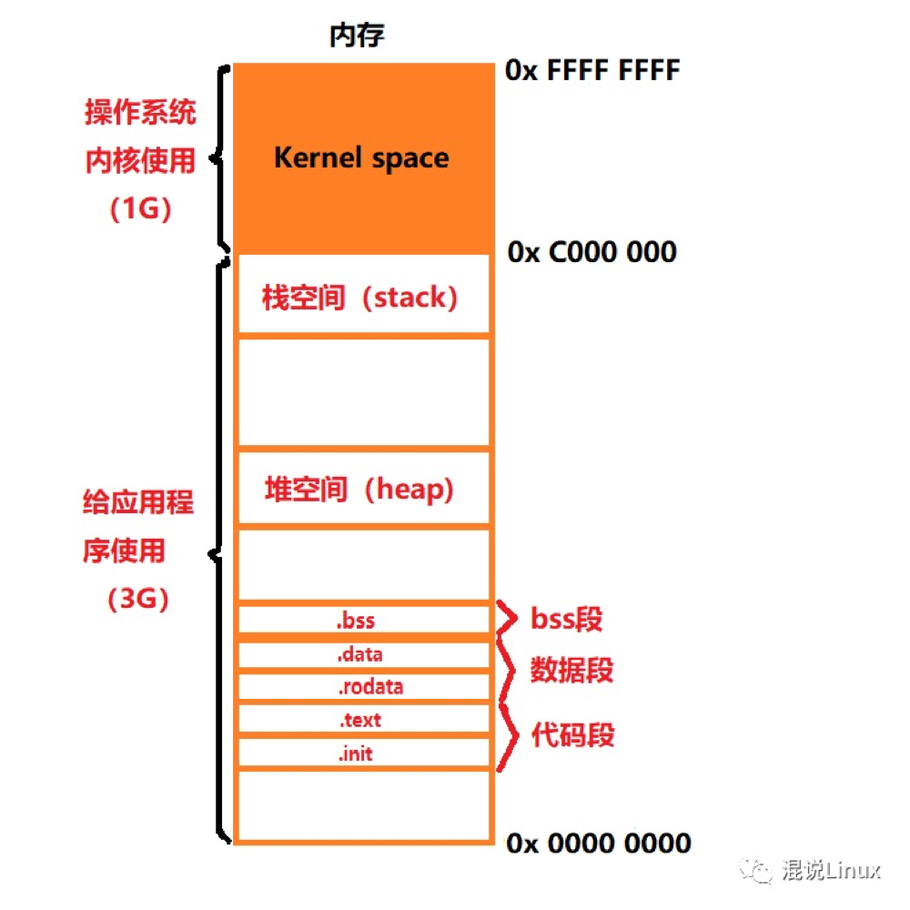

# 引用类型 && 值类型

## 引用类型

> Reference Type

- 引用类型的值是可变的
- 可以为引用类型添加或者删除属性和方法
- 引用类型可以拥有属性和方法，并且可以动态改变
- 引用类型的值是同时保存在栈内存和堆内存中的对象

> 引用类型的存储需要内存的栈区和堆区（堆区值内存中的堆内存）共同完成，栈区内存保存独享的标识符以及指向堆内存中该对象的指针，也可以说是该对象在堆内存中的地址

## 值类型

> Value Type
>
> 值类型是一种存储在栈内存的对象

- 值类型的值一旦确定就不可变
- 基本类型的比较就是值的比较，只有值相等时，两者才相等
- 基本类型的变量是存放在栈区的

## 内存布局

在32位系统总的地址空间大小是2^32 = 4GB

在windows情况下，默认将高地址的2GB空间分配给内核(当然也可以分配1GB)
，而在Linux情况下，默认将高地址的1GB空间分配给内核，内核空间以外剩下的空间给用户使用也被称为用户空间。

- 栈空间（stack):

  进程地址空间中最顶部的段是栈，代码中调用函数、定义局部变量(但不包含static修饰的变量)
  或声明的类的实例等等都要使用栈空间，当函数执行完(也就是程序执行超过了这个函数的作用范围的时候)
  ，操作系统会把该函数在栈中存放的数据出栈，也就是函数执行完需要return的时候系统会自己释放内存。但是如果不断的向栈中压入数据，达到最大的栈空间大小的话就会栈溢出(
  stack overflow)，这时候程序运行就会出现段错误（Segmentation Fault)。

- 堆空间（heap):

  堆用于存储那些生存期与函数调用无关的数据，堆分配的接口通常有malloc()、calloc()、realloc()
  、new等，但是堆空间有一个特点就是申请空间之后如果不主动释放(free()、delete等)，那么这个堆空间会依然存在，所以这种动态申请的内存需要程序员自己分配和释放。

- bss段：

  bss(简称:Block Started by Symbol)段(bss segment)是用来保存未被初始化的全局变量或者静态(全局)
  变量的内容的一块内存区域，假如你写"static int a;" 或者 " int a; " , 则a的内容就保存在bss段中。

- 数据段：

  data数据段(data segment)和bss段都是用来保存全局变量或静态(全局)
  变量的内容的一块内存区域，区别在于数据段是保存已经初始化的全局变量或静态(全局)变量，假如你写"static int a = 2; " 或者 "
  int a = 2; " ,那么a的内容就保存在数据段中了，而且初始值为2。
  rodata则是用来存放常量的一块内存区域。

- 代码段：

  代码段(code segment/text segment)分为两个部分: text和 init。
  - text 用于存放整个程序中的代码。
  - init 用于存放系统中用来初始化启动你的程序的一段代码。

## 为什么js的引用类型设计成了引用类型

为什么数组是引用类型，不能设计成值类型

> 在JavaScript中，所谓的栈和堆都是放在堆内存中的，而在堆内存中，JS把其分为栈结构和堆结构

栈会自动分配内存空间，会自动释放，存放基本类型和引用数据类型的变量,存取速度比堆快,存在栈中的数据大小与生存期必须是***
确定***的，缺乏灵活性。

堆(heap) :动态分配的内存，大小不定也不会自动释放，存放引用类型的对象，指那些可能由多个值构成的对象，保存在堆内存中。

堆内存中的对象不会随方法的结束而销毁，即使方法结束后，这个对象还可能被另一个引用变量所引用(参数传递)。创建对象是为了反复利用。

## 为什么某些语言的数组是值类型

- go 里面数组长度是定长
